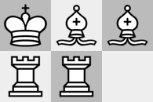
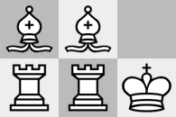

## Chess Puzzle

- A board game of **3x2** size, which has:
  - 1 King
  - 2 Rooks
  - 2 Bishop
- The chess pieces move according to the rule of the chess.
- Game starts with the below mentioned state:

  

- Game ends when the player reaches below mentioned state:

   

- Game keeps record of **Top 10** player in respect with ***Steps*** and ***Time Taken*** to complete the game.
- Game have Load/Save feature. *Note: If previous game loaded, time will start from (1.5 seconds x Moves).* 

### Project Information
- Project have reasonable GUI using [OpenJFX](https://openjfx.io/) and is implemented according to *MVC Architectural Pattern*.
- The project stores data in *XML file* at location: *~/.chess-puzzle/* using [JAXB](https://docs.oracle.com/javase/tutorial/jaxb/intro/index.html).
- The project uses [JUnit5](https://junit.org/junit5/) for unit testing the [ChessPuzzleState](src/main/java/chesspuzzle/state/ChessPuzzleState.java) class.
- The project uses [SLF4J](http://www.slf4j.org/) with [Apache Log4j 2](https://logging.apache.org/log4j/2.x/) for logging.

### Requirements
Building the project requires JDK 11 or later and [Apache Maven](https://maven.apache.org/)

### Maven Plugins
- [Maven Javadoc Plugin](https://maven.apache.org/plugins/maven-javadoc-plugin/)
- [Maven JXR Plugin](https://maven.apache.org/jxr/maven-jxr-plugin/)
- [Maven Checkstyle Plugin](https://maven.apache.org/plugins/maven-checkstyle-plugin/)
- [Maven Surefire Plugin](https://maven.apache.org/surefire/maven-surefire-report-plugin/)
- [Clover Maven Plugin](https://openclover.org/doc/maven/latest/) *(If define explicitly)*